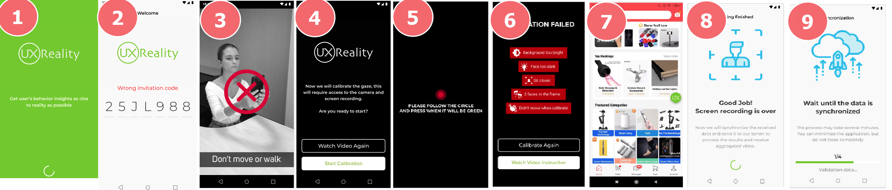

# UI Overview

## Общая структура приложения состоит из следующих экранов:

1. **[Splash Screen:](./screens/splash.md)** Показывается при загрузке приложения.
2. **[Enter Screen:](./screens/enter.md)** Ввод survey code, валидация кода, пермишены
3. **[Video Screen:](./screens/video.md)** Показывает видео инструкцию, каждый раз после успешной проверки кода.
4. **[Calibration Info Screen:](./screens/calibration-info.md)** Уведомляем что начнем калибровку.
5. **[Calibration Screen:](./screens/calibration.md)** Показываем точку калибровки.
6. **[Calibration Status Screen:](./screens/calibration-status.md)** Выводим результаты калибровки.
7. **WebCiew Screen:** Загружаем webview.
8. **Recording Stopped Screen:** Говорим что запись закончена.
9. **[Synchronization Screen:](./screens/sync.md)** Выводим прогресс синхронизации