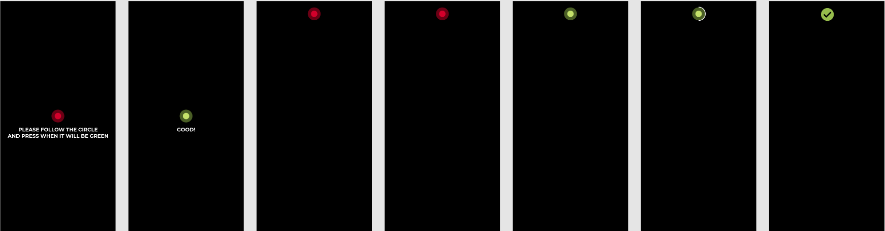

# Calibration screen

1. Перед калибровкой проверяем наличие лица в кадре (face detect)
2. Если лицо обнаружено перходим к этапу калибровки
3. На этапе калибровки:
  - пишем видео с камеры в файл, до момента когда последняя точка на экране остановится. Если ошибок нет видео отправляем на сервер. В другом случае видео удаляем
  - для каждой точки в момент показа отправляем фрейм с камеры. В ответе получаем информацию по точке
  - Если в ответе нет ошибки переходим к этапу сбору данных (app, webview)